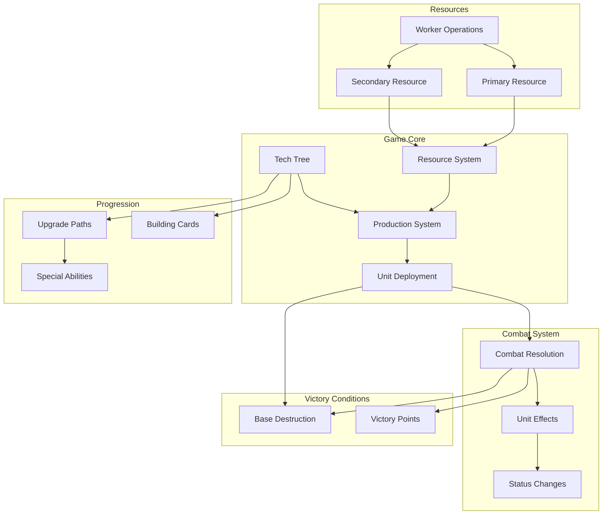
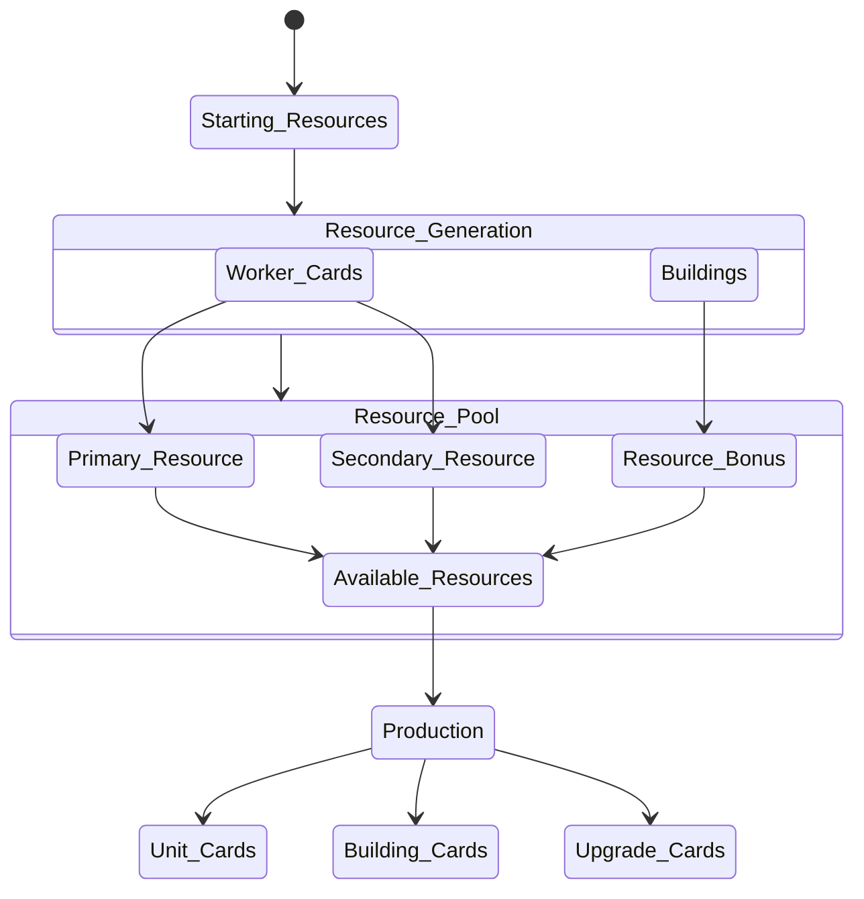
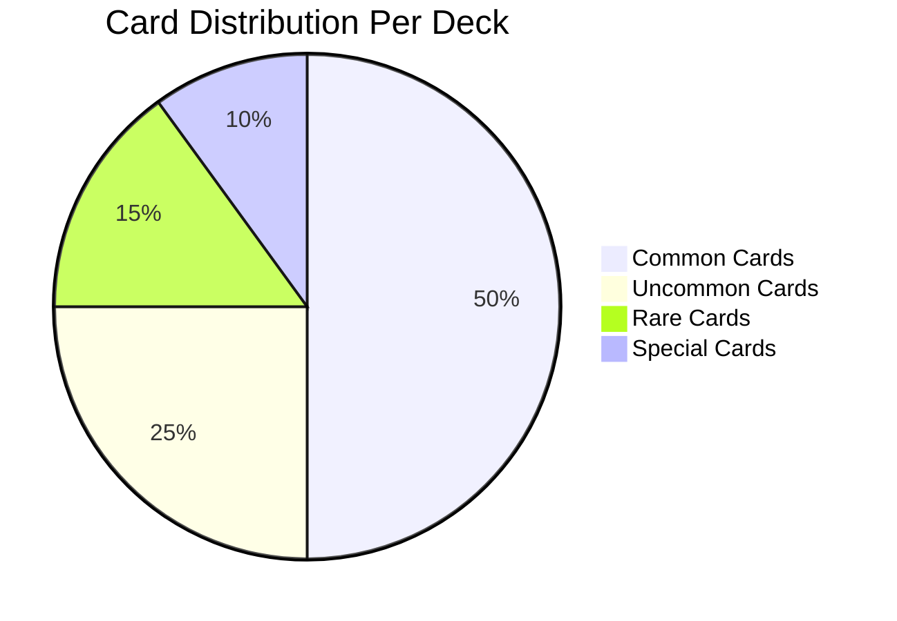
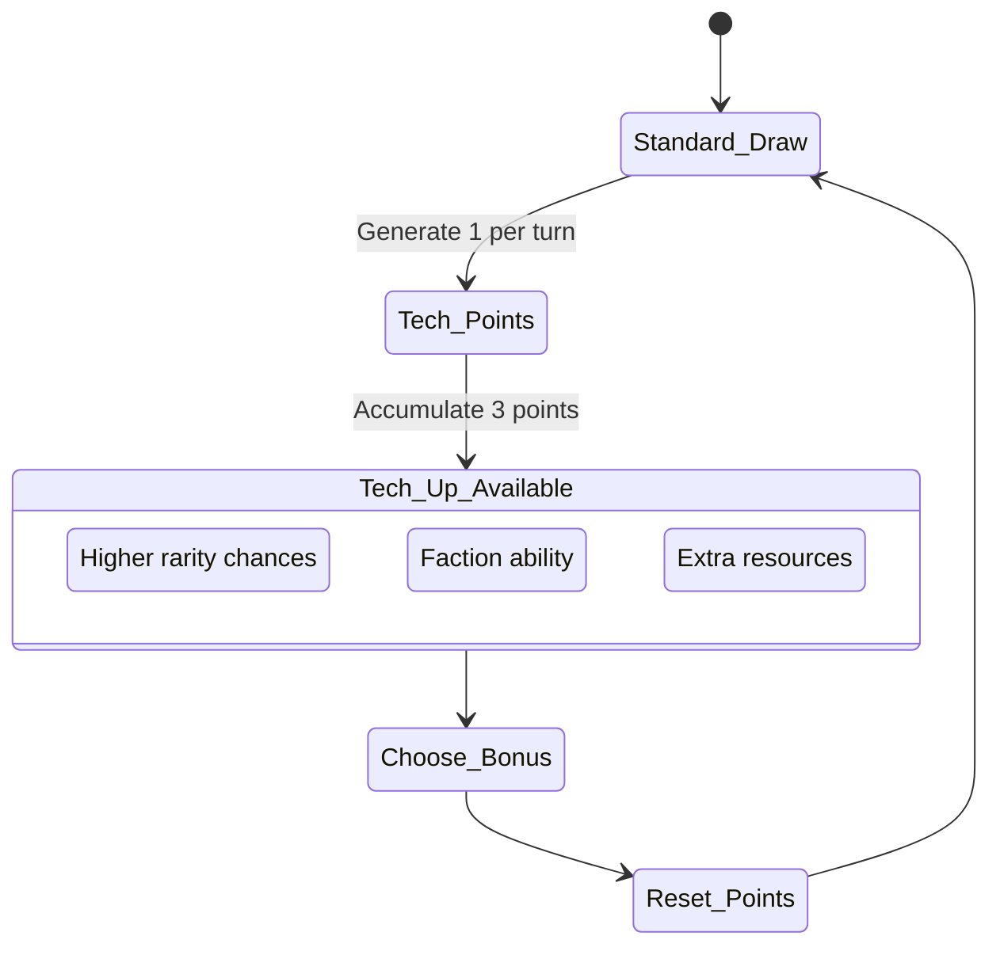
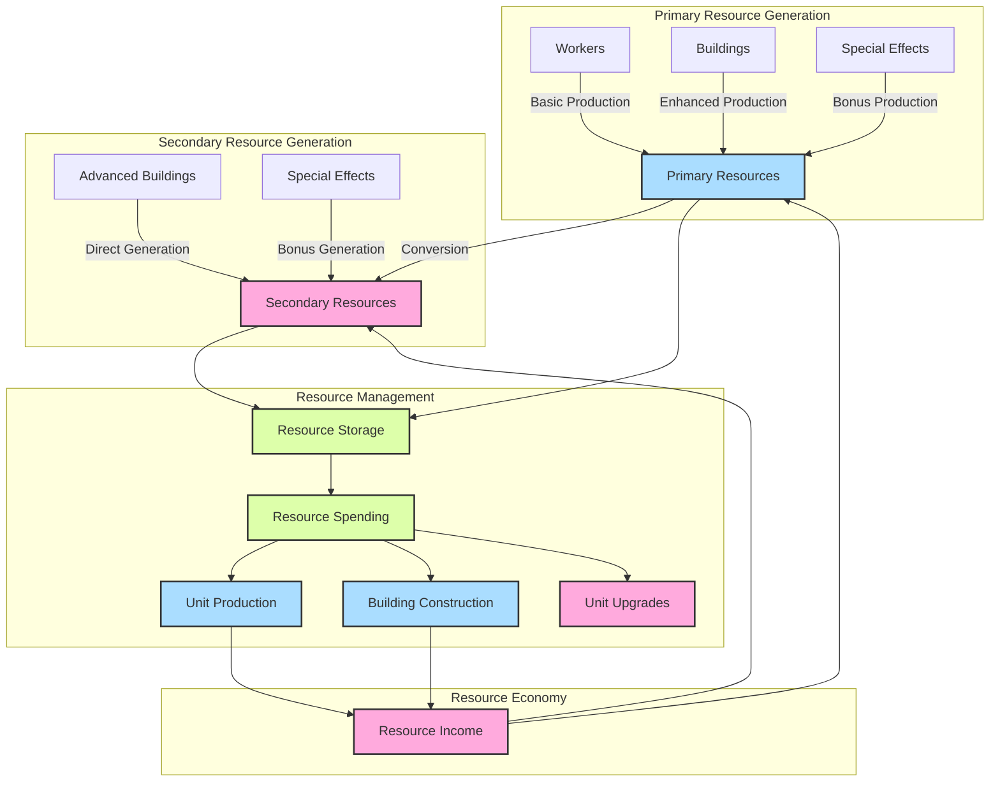
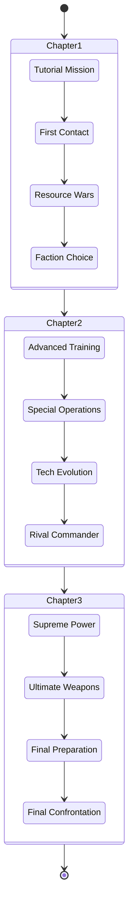
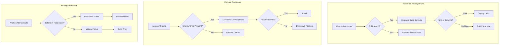

# Game Documentation 📚🎮

## Overview 🌐
This document provides a detailed overview of the core systems, resources, combat mechanics, progression paths, and victory conditions of the game. Additionally, it defines the three unique factions: The Mechanists, The Luminari, and The Swarmborn.

## Game Core 🕹️

### Resource System 💎
The Resource System is the backbone of the game, enabling the production and deployment of units.

- **Primary Resource**: The main resource required for most actions.
- **Secondary Resource**: A supplementary resource used for advanced actions.
- **Worker Operations**: Workers gather both primary and secondary resources.

### Production System 🏭
The Production System utilizes resources to produce units and buildings.

- **Unit Deployment**: Deploy units onto the battlefield using resources.
- **Building Cards**: Construct buildings that provide various benefits and capabilities.

### Tech Tree 🌳
The Tech Tree allows players to unlock new technologies and upgrades.

- **Upgrade Paths**: Enhance units and buildings with new abilities and improved stats.
- **Special Abilities**: Unlock unique abilities that provide strategic advantages.

## Resources 💰

### Primary Resource 💠
The main resource required for most actions in the game.

### Secondary Resource 🔶
A supplementary resource used for advanced actions and abilities.

### Worker Operations 👷
Workers gather both primary and secondary resources, fueling the player's economy.

## Combat System ⚔️

### Unit Deployment 🚀
Deploy units onto the battlefield using resources.

### Combat Resolution 🛡️
Resolve combat encounters between units.

- **Unit Effects**: Apply effects that units have during combat.
- **Status Changes**: Track changes in unit status, such as health and buffs/debuffs.

## Progression 📈

### Tech Tree 🌳
Unlock new technologies and upgrades.

- **Upgrade Paths**: Enhance units and buildings with new abilities and improved stats.
- **Special Abilities**: Unlock unique abilities that provide strategic advantages.
- **Building Cards**: Construct buildings that provide various benefits and capabilities.

## Victory Conditions 🏆

### Base Destruction 💥
Destroy the opponent's base to achieve victory.

### Victory Points 🏅
Accumulate victory points through various in-game actions to win.

## Factions 🛡️

### The Mechanists ⚙️
**Theme**: Industrial cyborg civilization
**Specialty**: Modular units, adaptable strategies

### The Luminari 🌟
**Theme**: Crystal-based energy beings
**Specialty**: Powerful units with shield mechanics

### The Swarmborn 🦠
**Theme**: Biological collective of evolved species
**Specialty**: Rapid reproduction and evolution

---

This documentation provides a comprehensive overview of the game's core systems, resources, combat mechanics, progression paths, and victory conditions, along with detailed descriptions of the three unique factions. Happy gaming! 🎮😊

add the mermaid chart?


# Game Documentation 📚🎮

## Overview 🌐
This document provides a detailed overview of the core systems, resources, combat mechanics, progression paths, and victory conditions of the game. Additionally, it defines the three unique factions: The Mechanists, The Luminari, and The Swarmborn.

## Game Core 🕹️

### Resource System 💎
The Resource System is the backbone of the game, enabling the production and deployment of units.

- **Primary Resource**: The main resource required for most actions.
- **Secondary Resource**: A supplementary resource used for advanced actions.
- **Worker Operations**: Workers gather both primary and secondary resources.

### Production System 🏭
The Production System utilizes resources to produce units and buildings.

- **Unit Deployment**: Deploy units onto the battlefield using resources.
- **Building Cards**: Construct buildings that provide various benefits and capabilities.

### Tech Tree 🌳
The Tech Tree allows players to unlock new technologies and upgrades.

- **Upgrade Paths**: Enhance units and buildings with new abilities and improved stats.
- **Special Abilities**: Unlock unique abilities that provide strategic advantages.

## Resources 💰

### Primary Resource 💠
The main resource required for most actions in the game.

### Secondary Resource 🔶
A supplementary resource used for advanced actions and abilities.

### Worker Operations 👷
Workers gather both primary and secondary resources, fueling the player's economy.

## Combat System ⚔️

### Unit Deployment 🚀
Deploy units onto the battlefield using resources.

### Combat Resolution 🛡️
Resolve combat encounters between units.

- **Unit Effects**: Apply effects that units have during combat.
- **Status Changes**: Track changes in unit status, such as health and buffs/debuffs.

## Progression 📈

### Tech Tree 🌳
Unlock new technologies and upgrades.

- **Upgrade Paths**: Enhance units and buildings with new abilities and improved stats.
- **Special Abilities**: Unlock unique abilities that provide strategic advantages.
- **Building Cards**: Construct buildings that provide various benefits and capabilities.

## Victory Conditions 🏆

### Base Destruction 💥
Destroy the opponent's base to achieve victory.

### Victory Points 🏅
Accumulate victory points through various in-game actions to win.

## Factions 🛡️

### The Mechanists ⚙️
**Theme**: Industrial cyborg civilization
**Specialty**: Modular units, adaptable strategies

### The Luminari 🌟
**Theme**: Crystal-based energy beings
**Specialty**: Powerful units with shield mechanics

### The Swarmborn 🦠
**Theme**: Biological collective of evolved species
**Specialty**: Rapid reproduction and evolution

## Mermaid Chart 📊


# Game Documentation 📚🎮

## Overview 🌐
This document provides a detailed overview of the core systems, resources, combat mechanics, progression paths, and victory conditions of the game. Additionally, it defines the three unique factions: The Mechanists, The Luminari, and The Swarmborn.

## Game Core 🕹️

### Resource System 💎
The Resource System is the backbone of the game, enabling the production and deployment of units.

- **Primary Resource**: The main resource required for most actions.
- **Secondary Resource**: A supplementary resource used for advanced actions.
- **Worker Operations**: Workers gather both primary and secondary resources.

### Production System 🏭
The Production System utilizes resources to produce units and buildings.

- **Unit Deployment**: Deploy units onto the battlefield using resources.
- **Building Cards**: Construct buildings that provide various benefits and capabilities.

### Tech Tree 🌳
The Tech Tree allows players to unlock new technologies and upgrades.

- **Upgrade Paths**: Enhance units and buildings with new abilities and improved stats.
- **Special Abilities**: Unlock unique abilities that provide strategic advantages.

## Resources 💰

### Primary Resource 💠
The main resource required for most actions in the game.

### Secondary Resource 🔶
A supplementary resource used for advanced actions and abilities.

### Worker Operations 👷
Workers gather both primary and secondary resources, fueling the player's economy.

## Combat System ⚔️

### Unit Deployment 🚀
Deploy units onto the battlefield using resources.

### Combat Resolution 🛡️
Resolve combat encounters between units.

- **Unit Effects**: Apply effects that units have during combat.
- **Status Changes**: Track changes in unit status, such as health and buffs/debuffs.

## Progression 📈

### Tech Tree 🌳
Unlock new technologies and upgrades.

- **Upgrade Paths**: Enhance units and buildings with new abilities and improved stats.
- **Special Abilities**: Unlock unique abilities that provide strategic advantages.
- **Building Cards**: Construct buildings that provide various benefits and capabilities.

## Victory Conditions 🏆

### Base Destruction 💥
Destroy the opponent's base to achieve victory.

### Victory Points 🏅
Accumulate victory points through various in-game actions to win.

## Factions 🛡️

### The Mechanists ⚙️
**Theme**: Industrial cyborg civilization
**Specialty**: Modular units, adaptable strategies

### The Luminari 🌟
**Theme**: Crystal-based energy beings
**Specialty**: Powerful units with shield mechanics

### The Swarmborn 🦠
**Theme**: Biological collective of evolved species
**Specialty**: Rapid reproduction and evolution

## Mermaid Chart 📊


## Resource System Details 💎



## Basic Game Rules 📜

### Starting Setup 🛠️
Players start with the following:

1. **1 Base card**
2. **3 Worker cards**
3. **5 Basic unit cards**
4. **20 starting Primary Resources**
5. **5 starting Secondary Resources**
---



Let's design the core card structure:

Card Deck Composition (100 cards total):


50 Common Cards (50%)

Basic units
Basic resource generators
Common buildings


25 Uncommon Cards (25%)

Advanced units
Improved buildings
Basic upgrades


15 Rare Cards (15%)

Elite units
Special buildings
Advanced upgrades


10 Special Cards (10%)

Faction-unique units
Game-changing abilities
Supreme upgrades


Draw Mechanics:
markdownCopyStandard Draw:
- Draw 3 cards
- ~25% chance of drawing at least one Special/Rare card
- Individual draw probabilities:
  * Common: 50%
  * Uncommon: 25%
  * Rare: 15%
  * Special: 10%

Tech-Up Draw (Available once per 3 turns):
- Draw 2 cards
- Guaranteed at least Uncommon or better
- Higher chance for Rare/Special
To maintain the 25% chance for "good" cards while keeping the game balanced:

Card Quality Control:


Special cards are powerful but not game-breaking
All cards remain viable throughout the game
Common cards can combine for powerful effects


Resource Requirements:

markdownCopyCard Type | Primary Resource | Secondary Resource
---------|------------------|-------------------
Common   | 1-2              | 0-1
Uncommon | 2-3              | 1-2
Rare     | 3-4              | 2-3
Special  | 4-5              | 3-4

Balance Mechanics:


Higher-rarity cards require more setup
Common cards can counter special cards when played strategically
Resource investment scales with card power

Would you like me to:

Design specific card examples for each rarity
Create detailed probability tables for different draw scenarios
Develop the "Tech-Up" mechanic further
Design faction-specific card distribution variations


I'll develop the specific cards and their faction variations, plus expand on the Tech-Up system.

```mermaid
graph TB
    subgraph Mechanists
        M1[Basic Factory] -->|3 PR| M2[Advanced Factory]
        M2 -->|4 PR + 2 SR| M3[Research Center]
        M3 -->|5 PR + 3 SR| M4[Innovation Hub]
    end

    subgraph Luminari
        L1[Energy Core] -->|3 PR| L2[Crystal Chamber]
        L2 -->|4 PR + 2 SR| L3[Ascension Gate]
        L3 -->|5 PR + 3 SR| L4[Celestial Nexus]
    end

    subgraph Swarmborn
        S1[Evolution Den] -->|3 PR| S2[Mutation Chamber]
        S2 -->|4 PR + 2 SR| S3[Adaptation Pit]
        S3 -->|5 PR + 3 SR| S4[Genesis Pool]
    end

    classDef basic fill:#ddd,stroke:#333,stroke-width:2px;
    classDef advanced fill:#bbd,stroke:#333,stroke-width:2px;
    classDef rare fill:#dbf,stroke:#333,stroke-width:2px;
    classDef special fill:#d9f,stroke:#333,stroke-width:2px;

    class M1,L1,S1 basic;
    class M2,L2,S2 advanced;
    class M3,L3,S3 rare;
    class M4,L4,S4 special;
```





Let's detail specific cards for each faction, showing how they progress through rarities:
### Mechanists (Industrial Cyborg Faction)

**Common Cards:**
- Cyber Worker (1 PR)
  - Generates: 1 PR per turn
  - Effect: Can be upgraded to increase production
- Assembly Unit (2 PR)
  - Attack: 2 | Health: 2
  - Effect: +1 attack when adjacent to other Assembly Units

**Uncommon Cards:**
- Modular Tank (3 PR, 1 SR)
  - Attack: 3 | Health: 4
  - Effect: Can be equipped with one weapon modification
- Production Facility (2 PR, 2 SR)
  - Building
  - Effect: Reduce cost of next unit by 1 PR

**Rare Cards:**
- Battle Mech Commander (4 PR, 2 SR)
  - Attack: 5 | Health: 5
  - Effect: Adjacent mechanical units gain +1/+1
- Nano-Factory (3 PR, 3 SR)
  - Building
  - Effect: Create a copy of one basic unit per turn

**Special Cards:**
- Omega Titan (5 PR, 4 SR)
  - Attack: 8 | Health: 8
  - Effect: Can split into two 4/4 Mech units when destroyed

### Luminari (Crystal Energy Faction)

**Common Cards:**
- Crystal Harvester (1 PR)
  - Generates: 1 PR per turn
  - Effect: Gains +1 shield when not moving
- Light Scout (2 PR)
  - Attack: 1 | Health: 2
  - Effect: Has Shield 1 (blocks first damage)

**Uncommon Cards:**
- Energy Sentinel (3 PR, 1 SR)
  - Attack: 2 | Health: 3
  - Effect: Shield 2, can redirect damage to shields
- Crystal Pylon (2 PR, 2 SR)
  - Building
  - Effect: Adjacent units gain Shield 1

**Rare Cards:**
- Celestial Archon (4 PR, 2 SR)
  - Attack: 4 | Health: 4
  - Effect: Shield 3, can share shields with allies
- Energy Matrix (3 PR, 3 SR)
  - Building
  - Effect: Restore all shields to full each turn

**Special Cards:**
- Grand Hierarch (5 PR, 4 SR)
  - Attack: 6 | Health: 6
  - Effect: Shield 4, can convert damage to energy resources

### Swarmborn (Biological Evolution Faction)

**Common Cards:**
- Drone Worker (1 PR)
  - Generates: 1 PR per turn
  - Effect: Can be sacrificed to spawn two new Drones
- Swarm Crawler (2 PR)
  - Attack: 1 | Health: 1
  - Effect: Spawns a 1/1 token when it dies

**Uncommon Cards:**
- Evolution Engine (3 PR, 1 SR)
  - Attack: 2 | Health: 4
  - Effect: Evolves after surviving damage
- Spawning Pool (2 PR, 2 SR)
  - Building
  - Effect: Create a 1/1 token each turn

**Rare Cards:**
- Brood Leader (4 PR, 2 SR)
  - Attack: 3 | Health: 6
  - Effect: Nearby units evolve faster
- Mutation Chamber (3 PR, 3 SR)
  - Building
  - Effect: Choose one unit to evolve each turn

**Special Cards:**
- Hivemind Matriarch (5 PR, 4 SR)
  - Attack: 5 | Health: 7
  - Effect: Creates custom evolved units based on destroyed allies





Standard Draw vs Tech-Up Draw Chances:

Standard Draw:
- Common: 50%
- Uncommon: 25%
- Rare: 15%
- Special: 10%

Tech-Up Draw:
- Common: 25%
- Uncommon: 35%
- Rare: 25%
- Special: 15%

Faction Bonus (During Tech-Up):
Mechanists: +5% chance for Rare
Luminari: +5% chance for Special
Swarmborn: +10% chance for Uncommon


```mermaid
graph TB
    subgraph "Basic Combos"
        B1[Base Card] --> B2[Enhancer Card]
        B2 --> B3[Result Card]
        B3 --> BE{Enhanced Effect}
    end

    subgraph "Advanced Chain Combos"
        C1[Trigger Card] --> C2[Chain Card 1]
        C2 --> C3[Chain Card 2]
        C3 --> C4[Chain Card 3]
        C4 --> CE{Chain Effect}
    end

    subgraph "Special Faction Combos"
        F1[Faction Base] --> F2[Faction Special]
        F2 --> F3[Ultimate Card]
        F3 --> FE{Ultimate Effect}
    end

    BE --> Victory[Victory Points]
    CE --> Victory
    FE --> Victory

    classDef basic fill:#ddd,stroke:#333,stroke-width:2px;
    classDef chain fill:#bbd,stroke:#333,stroke-width:2px;
    classDef special fill:#dbf,stroke:#333,stroke-width:2px;

    class B1,B2,B3 basic;
    class C1,C2,C3,C4 chain;
    class F1,F2,F3 special;
  ```
Let's detail specific cards for each faction, showing how they progress through rarities:
### Mechanists (Industrial Cyborg Faction)

**Common Cards:**
- Cyber Worker (1 PR)
  - Generates: 1 PR per turn
  - Effect: Can be upgraded to increase production
- Assembly Unit (2 PR)
  - Attack: 2 | Health: 2
  - Effect: +1 attack when adjacent to other Assembly Units

**Uncommon Cards:**
- Modular Tank (3 PR, 1 SR)
  - Attack: 3 | Health: 4
  - Effect: Can be equipped with one weapon modification
- Production Facility (2 PR, 2 SR)
  - Building
  - Effect: Reduce cost of next unit by 1 PR

**Rare Cards:**
- Battle Mech Commander (4 PR, 2 SR)
  - Attack: 5 | Health: 5
  - Effect: Adjacent mechanical units gain +1/+1
- Nano-Factory (3 PR, 3 SR)
  - Building
  - Effect: Create a copy of one basic unit per turn

**Special Cards:**
- Omega Titan (5 PR, 4 SR)
  - Attack: 8 | Health: 8
  - Effect: Can split into two 4/4 Mech units when destroyed

### Luminari (Crystal Energy Faction)

**Common Cards:**
- Crystal Harvester (1 PR)
  - Generates: 1 PR per turn
  - Effect: Gains +1 shield when not moving
- Light Scout (2 PR)
  - Attack: 1 | Health: 2
  - Effect: Has Shield 1 (blocks first damage)

**Uncommon Cards:**
- Energy Sentinel (3 PR, 1 SR)
  - Attack: 2 | Health: 3
  - Effect: Shield 2, can redirect damage to shields
- Crystal Pylon (2 PR, 2 SR)
  - Building
  - Effect: Adjacent units gain Shield 1

**Rare Cards:**
- Celestial Archon (4 PR, 2 SR)
  - Attack: 4 | Health: 4
  - Effect: Shield 3, can share shields with allies
- Energy Matrix (3 PR, 3 SR)
  - Building
  - Effect: Restore all shields to full each turn

**Special Cards:**
- Grand Hierarch (5 PR, 4 SR)
  - Attack: 6 | Health: 6
  - Effect: Shield 4, can convert damage to energy resources

### Swarmborn (Biological Evolution Faction)

**Common Cards:**
- Drone Worker (1 PR)
  - Generates: 1 PR per turn
  - Effect: Can be sacrificed to spawn two new Drones
- Swarm Crawler (2 PR)
  - Attack: 1 | Health: 1
  - Effect: Spawns a 1/1 token when it dies

**Uncommon Cards:**
- Evolution Engine (3 PR, 1 SR)
  - Attack: 2 | Health: 4
  - Effect: Evolves after surviving damage
- Spawning Pool (2 PR, 2 SR)
  - Building
  - Effect: Create a 1/1 token each turn

**Rare Cards:**
- Brood Leader (4 PR, 2 SR)
  - Attack: 3 | Health: 6
  - Effect: Nearby units evolve faster
- Mutation Chamber (3 PR, 3 SR)
  - Building
  - Effect: Choose one unit to evolve each turn

**Special Cards:**
- Hivemind Matriarch (5 PR, 4 SR)
  - Attack: 5 | Health: 7
  - Effect: Creates custom evolved units based on destroyed allies


  Let's expand on the Tech-Up system:


  ```mermaid
  stateDiagram-v2
      [*] --> Standard_Draw

      Standard_Draw --> Tech_Points: Generate 1 per turn
      Tech_Points --> Tech_Up_Available: Accumulate 3 points

      state Tech_Up_Available {
          Enhanced_Draw: Higher rarity chances
          Special_Action: Faction ability
          Resource_Boost: Extra resources
      }

      Tech_Up_Available --> Choose_Bonus
      Choose_Bonus --> Reset_Points
      Reset_Points --> Standard_Draw
  ```
Tech-Up Probability Adjustments:
Standard Draw vs Tech-Up Draw Chances:

Standard Draw:
- Common: 50%
- Uncommon: 25%
- Rare: 15%
- Special: 10%

Tech-Up Draw:
- Common: 25%
- Uncommon: 35%
- Rare: 25%
- Special: 15%

Faction Bonus (During Tech-Up):
Mechanists: +5% chance for Rare
Luminari: +5% chance for Special
Swarmborn: +10% chance for Uncommon


```mermaid
graph TB
    subgraph "Basic Combos"
        B1[Base Card] --> B2[Enhancer Card]
        B2 --> B3[Result Card]
        B3 --> BE{Enhanced Effect}
    end

    subgraph "Advanced Chain Combos"
        C1[Trigger Card] --> C2[Chain Card 1]
        C2 --> C3[Chain Card 2]
        C3 --> C4[Chain Card 3]
        C4 --> CE{Chain Effect}
    end

    subgraph "Special Faction Combos"
        F1[Faction Base] --> F2[Faction Special]
        F2 --> F3[Ultimate Card]
        F3 --> FE{Ultimate Effect}
    end

    BE --> Victory[Victory Points]
    CE --> Victory
    FE --> Victory

    classDef basic fill:#ddd,stroke:#333,stroke-width:2px;
    classDef chain fill:#bbd,stroke:#333,stroke-width:2px;
    classDef special fill:#dbf,stroke:#333,stroke-width:2px;

    class B1,B2,B3 basic;
    class C1,C2,C3,C4 chain;
    class F1,F2,F3 special;

```

# Faction-Specific Combo Systems

## Mechanists (Industrial Synergy)

### Production Chains
1. Basic Chain: "Assembly Line"
- Worker → Assembly Unit → Modular Tank
- Effect: Each unit produced reduces next unit cost by 1
- Maximum discount: 3 PR per unit

2. Advanced Chain: "Factory Override"
- Production Facility → Nano-Factory → Battle Mech Commander
- Effect: Creates duplicate units with temporary boost
- Bonus: +2/+2 to all mechanical units for 2 turns

3. Ultimate Chain: "Industrial Revolution"
- Omega Titan + 3 Production Facilities
- Effect: Mass produce mini-titans (3/3) each turn
- Victory potential: Overwhelm through superior production

### Key Synergies

Unit Combinations:
- Assembly Units (x3): Form production line (+1 PR each)
- Modular Tanks (x2) + Commander: Create siege formation
- Nano-Factory + Basic Units: Swarm tactics

Resource Management:
- Workers can upgrade to Advanced Workers
- Buildings chain for resource multiplication
- Tech tree reduces unit costs over time


## Luminari (Energy Manifestation)

### Shield Chains
1. Basic Chain: "Energy Cascade"
- Crystal Harvester → Energy Sentinel → Celestial Archon
- Effect: Compounds shield generation
- Shield transfer between units

2. Advanced Chain: "Crystal Matrix"
- Crystal Pylon → Energy Matrix → Multiple Sentinels
- Effect: Creates shield regeneration network
- Bonus: Converts excess shields to damage

3. Ultimate Chain: "Hierarch's Ascension"
- Grand Hierarch + 3 Energy Matrices
- Effect: Infinite shield regeneration
- Victory potential: Unstoppable defensive force

### Key Synergies

Shield Management:
- Connected units share shield pool
- Damaged shields generate secondary resources
- Shield overload creates energy attacks

Resource Generation:
- Crystal networks multiply energy generation
- Shield conversion to resources
- Energy storage in pylons


## Swarmborn (Evolution Paths)

### Evolution Chains
1. Basic Chain: "Rapid Evolution"
- Drone Worker → Swarm Crawler → Evolution Engine
- Effect: Accelerated unit evolution
- Creates evolved tokens each turn

2. Advanced Chain: "Mutation Mastery"
- Spawning Pool → Mutation Chamber → Brood Leader
- Effect: Custom unit evolution paths
- Bonus: Evolved units gain additional abilities

3. Ultimate Chain: "Hivemind Awakening"
- Hivemind Matriarch + 3 Evolution Engines
- Effect: Mass evolution of all units
- Victory potential: Exponential growth

### Key Synergies
Evolution Mechanics:
- Units stack evolution buffs
- Death triggers spawn new units
- Mutation paths branch for specialization

Swarm Tactics:
- Token units evolve independently
- Sacrifice mechanics for power gains
- Brood Leaders affect nearby evolution


Let's detail the victory conditions and scoring system

```mermaid
stateDiagram-v2
    [*] --> Game_Start

    Game_Start --> Primary_Victory
    Game_Start --> Secondary_Victory
    Game_Start --> Special_Victory

    state Primary_Victory {
        Base_Destruction: Destroy enemy base
        Resource_Control: Control 75% of resources
        Board_Dominance: Control 80% of board
    }

    state Secondary_Victory {
        Tech_Superiority: Complete tech tree
        Unit_Supremacy: Field 5 special units
        Resource_Engine: Generate 20 PR per turn
    }

    state Special_Victory {
        Mechanist_Victory: Control all production points
        Luminari_Victory: Achieve perfect defense
        Swarmborn_Victory: Evolution completion
    }

    Primary_Victory --> Game_End
    Secondary_Victory --> Game_End
    Special_Victory --> Game_End
    Game_End --> [*]
  ```

  ## Unit Evolution and Upgrade Trees

```mermaid
graph TB
    subgraph Mechanists
        MB[Basic Unit] -->|2 PR| MM1[Modular Upgrade]
        MB -->|2 PR| MM2[Armor Upgrade]
        MM1 -->|3 PR + 1 SR| MM3[Advanced Modularity]
        MM2 -->|3 PR + 1 SR| MM4[Heavy Plating]
        MM3 -->|4 PR + 2 SR| MM5[Ultimate Form]
        MM4 -->|4 PR + 2 SR| MM5
    end

    subgraph Luminari
        LB[Basic Unit] -->|2 PR| LM1[Shield Enhancement]
        LB -->|2 PR| LM2[Energy Infusion]
        LM1 -->|3 PR + 1 SR| LM3[Crystal Resonance]
        LM2 -->|3 PR + 1 SR| LM4[Power Manifestation]
        LM3 -->|4 PR + 2 SR| LM5[Ascended Form]
        LM4 -->|4 PR + 2 SR| LM5
    end

    subgraph Swarmborn
        SB[Basic Unit] -->|2 PR| SM1[Rapid Evolution]
        SB -->|2 PR| SM2[Adaptive Mutation]
        SM1 -->|3 PR + 1 SR| SM3[Enhanced Strain]
        SM2 -->|3 PR + 1 SR| SM4[Specialized Form]
        SM3 -->|4 PR + 2 SR| SM5[Perfect Form]
        SM4 -->|4 PR + 2 SR| SM5
    end

    classDef basic fill:#ddd,stroke:#333,stroke-width:2px;
    classDef upgraded fill:#bbd,stroke:#333,stroke-width:2px;
    classDef ultimate fill:#dbf,stroke:#333,stroke-width:2px;
```




### Tournament Rules and Deck Building

# Tournament Format and Deck Construction Rules

## Basic Deck Requirements

Minimum Deck Size: 60 cards
Maximum Deck Size: 80 cards

Required Card Distribution:
- Workers/Resource Cards: 8-12
- Basic Units: 15-20
- Buildings: 8-12
- Upgrades: 10-15
- Special Cards: Maximum 8


## Tournament Formats

### Standard Format
1. Constructed Deck
- Pre-built deck following basic requirements
- Maximum 2 copies of any rare card
- Maximum 1 copy of any special card
- Minimum 20 common cards

2. Draft Format
- 8 players
- 3 packs of 15 cards each
- Pass direction alternates
- Must stay within chosen faction

3. Sealed Format
- 6 packs of 15 cards
- Can mix factions
- Minimum 40 card deck

## Resource Point System

### Deck Building Points

Card Type        | Build Points
-----------------|-------------
Common           | 1 point
Uncommon         | 2 points
Rare             | 3 points
Special          | 5 points

Maximum Points: 100 per deck
Minimum Points: 60 per deck


### Tournament Scoring

Victory Type     | Tournament Points
-----------------|-------------------
Primary Victory  | 3 points
Secondary Victory| 2 points
Close Loss      | 1 point

### Gameplay Scenerios and Combo Examples

# Strategic Scenarios and Combo Examples

## Mechanist Scenarios

### "Industrial Overload"

Setup:
- 3 Production Facilities
- 1 Battle Mech Commander
- 2 Assembly Units

Combo Execution:
1. Turn 1: Deploy Production Facilities
2. Turn 2: Chain produce Assembly Units
3. Turn 3: Deploy Commander
4. Turn 4: Mass produce with discount

Result:
- Generate 6 units per turn
- Each unit gains +1/+1
- Production cost reduced by 50%


## Luminari Scenarios

### "Crystal Fortress"

Setup:
- 2 Energy Matrices
- 1 Grand Hierarch
- 3 Crystal Pylons

Combo Execution:
1. Turn 1: Deploy Crystal Pylons
2. Turn 2: Setup Energy Matrices
3. Turn 3: Deploy Grand Hierarch
4. Turn 4: Activate shield network

Result:
- Infinite shield regeneration
- Convert excess shields to energy
- Impenetrable defense formation


## Swarmborn Scenarios

### "Evolution Cascade"

Setup:
- 1 Hivemind Matriarch
- 2 Evolution Engines
- 3 Spawning Pools

Combo Execution:
1. Turn 1: Deploy Spawning Pools
2. Turn 2: Setup Evolution Engines
3. Turn 3: Deploy Matriarch
4. Turn 4: Begin mass evolution

Result:
- Generate 3 evolved units per turn
- Each unit gains 2 evolution paths
- Exponential growth potential

### Resource Management



### Game Balance and Economy

```mermaid
# Resource and Economy Balance

## Resource Generation Rates

Basic Generation:
- Worker: 1 PR per turn
- Advanced Worker: 1 PR + 1 SR per turn
- Building: 2 PR per turn
- Advanced Building: 1 PR + 2 SR per turn

Faction Modifiers:
Mechanists: +25% from buildings
Luminari: +25% from special effects
Swarmborn: +25% from workers

## Economy Scaling

Early Game (Turns 1-3):
- Available PR: 3-5 per turn
- Available SR: 0-1 per turn
- Unit Cost: 1-2 PR

Mid Game (Turns 4-7):
- Available PR: 6-10 per turn
- Available SR: 2-4 per turn
- Unit Cost: 2-4 PR, 1-2 SR

Late Game (Turns 8+):
- Available PR: 11+ per turn
- Available SR: 5+ per turn
- Unit Cost: 3-5 PR, 2-4 SR


## Victory Point System

Primary Victory Points:
- Base Destruction: 10 points
- Resource Control: 8 points
- Board Dominance: 8 points

Secondary Victory Points:
- Tech Superiority: 6 points
- Unit Supremacy: 6 points
- Resource Engine: 6 points

Special Victory Points:
- Faction-specific: 10 points
- Perfect Game: +5 bonus points


### SVG Design
```svg
<svg viewBox="0 0 400 600" xmlns="http://www.w3.org/2000/svg">
  <!-- Card Base -->
  <rect x="20" y="20" width="360" height="560" rx="15" fill="#1f1f1f" stroke="#333" stroke-width="2"/>

  <!-- Title Bar -->
  <rect x="40" y="40" width="320" height="50" rx="5" fill="#333"/>
  <text x="55" y="72" font-family="Arial" font-size="24" fill="white">Card Name</text>

  <!-- Cost Circles -->
  <circle cx="340" cy="65" r="20" fill="#4a90e2"/>
  <text x="340" y="72" font-family="Arial" font-size="20" fill="white" text-anchor="middle">3</text>

  <!-- Art Frame -->
  <rect x="40" y="100" width="320" height="240" fill="#2a2a2a"/>
  <rect x="45" y="105" width="310" height="230" fill="#444" rx="5"/>

  <!-- Type Line -->
  <rect x="40" y="350" width="320" height="40" fill="#333"/>
  <text x="55" y="375" font-family="Arial" font-size="16" fill="#aaa">Unit Type - Subtype</text>

  <!-- Stats Box -->
  <rect x="40" y="400" width="320" height="140" fill="#2a2a2a"/>
  <text x="55" y="430" font-family="Arial" font-size="16" fill="#aaa">
    Attack: 3  |  Defense: 4
  </text>
  <text x="55" y="460" font-family="Arial" font-size="14" fill="#aaa">
    Card effect description goes here
  </text>

  <!-- Faction Symbol -->
  <circle cx="55" cy="555" r="15" fill="#4a90e2"/>
</svg>
```


## Campaign Mode Design

### Campaign Mode: Rise of the Factions

## Campaign Structure

Chapter 1: Origins
- Mission 1: Resource Gathering
- Mission 2: Basic Combat
- Mission 3: Faction Choice
- Boss Mission: Rival Commander

Chapter 2: Evolution
- Mission 1: Advanced Resources
- Mission 2: Special Units
- Mission 3: Combo Training
- Boss Mission: Elite Squadron

Chapter 3: Mastery
- Mission 1: Resource Management
- Mission 2: Advanced Tactics
- Mission 3: Ultimate Powers
- Final Mission: Supreme Commander


## Mission Types

### Story Missions

Structure:
- Pre-mission briefing
- Custom starting conditions
- Special objectives
- Post-mission rewards

Rewards:
- Unique cards
- Resource bonuses
- Unlock new mechanics


### Challenge Missions

Types:
1. Survival
   - Last specific number of turns
   - Limited resources
   - Waves of enemies

2. Resource Race
   - Generate target resources
   - Build specific structures
   - Time limit challenges

3. Special Operations
   - Use specific units/combos
   - Achieve victory conditions
   - Limited card pool


## Progression System

Experience Points:
- Mission completion: 100 XP
- Bonus objectives: 50 XP each
- Perfect victory: 100 XP bonus

Unlocks:
Level 1: Basic faction cards
Level 5: Special faction mechanics
Level 10: Ultimate faction cards
Level 15: Cross-faction abilities
Level 20: Legendary cards


# Multiplayer formats and team rules

# Multiplayer Game Modes

## Standard Formats

### Free-for-All (3-6 players)

Setup:
- Hexagonal board layout
- Equal starting resources
- Random turn order
- Individual victory conditions

Special Rules:
- Alliance forming allowed
- Resource sharing disabled
- Victory points tracked individually


### Team Battle (2v2 or 3v3)

Setup:
- Symmetrical board layout
- Shared resource pool
- Alternating team turns
- Combined victory conditions

Special Rules:
- Resource sharing enabled
- Shared card viewing
- Combined tech trees
- Team combo bonuses


### Commander Mode (4-8 players)

Setup:
- One player as Commander per team
- Commander has special abilities
- Subordinates follow orders
- Hierarchical resource system

Special Rules:
- Commander can:
  * Distribute resources
  * Issue team orders
  * Override card plays
  * Activate team abilities


## Tournament Formats

### Swiss Tournament

Format:
- Rounds based on player count
- Match scoring system
- Tiebreaker rules
- Final elimination rounds

Requirements:
- Minimum 8 players
- Standard deck rules
- Time limits per match
- Judge oversight


### Draft Tournament

Format:
- 8 player pods
- 3 pack drafting
- Deck building period
- Single elimination

Special Rules:
- Cross-faction drafting allowed
- Minimum 40 card decks
- Limited special card pool
- Balanced pack distribution


## Special Game Modes

### Archenemy

Format:
- 1 vs 3 players
- Archenemy gets advantages:
  * Double resources
  * Special powers
  * Extra cards
  * Bonus actions

Victory Conditions:
- Team: Defeat Archenemy
- Archenemy: Defeat all opponents


### Emperor

Format:
- 6 players (3v3)
- Center player is Emperor
- Protected by Generals
- Special Emperor powers

Rules:
- Emperors can't attack directly
- Generals protect Emperor
- Emperor has unique cards
- Special victory conditions


### Resource Rush

Format:
- 4-player economic focus
- Resource generation victory
- No direct combat
- Trade mechanics

Victory Conditions:
- First to 100 PR
- Resource monopoly
- Tech tree completion


# Campaign Mission Flow




# Detailed Mission Scenerios

## Campaign Mission Details

## Chapter 1: Origins

### Mission 1: Tutorial Mission

Scenario: "First Steps"
Starting Resources: 10 PR, 0 SR
Deck: Pre-constructed starter deck

Objectives:
1. Generate 5 PR in one turn
2. Deploy 3 basic units
3. Complete a basic combo

Special Rules:
- Guided tutorial prompts
- Unlimited turns
- No enemy attacks


### Mission 2: First Contact

Scenario: "Border Skirmish"
Starting Resources: 15 PR, 5 SR
Deck: Basic faction deck

Objectives:
1. Defeat 3 enemy units
2. Build a production facility
3. Research one technology

Enemy Behavior:
- Predictable attack patterns
- Limited resource generation
- Basic unit deployment


### Mission 3: Resource Wars

Scenario: "Resource Rush"
Starting Resources: 20 PR, 10 SR
Special Conditions: Contested resource nodes

Objectives:
1. Control 3 resource nodes
2. Generate 30 PR in one turn
3. Maintain control for 3 turns

Rewards:
- Unique resource generator card
- Faction-specific technology
- Special worker unit


## Chapter 2: Evolution

### Mission 4: Advanced Training

Scenario: "Tech Evolution"
Special Mechanics: Advanced technology tree
Starting Bonuses: Choose one special unit

Objectives:
1. Complete tech tree path
2. Deploy advanced unit
3. Perform 3-card combo

Victory Conditions:
- Research all technologies
- Defeat enemy commander
- Control tech centers


## Mission Rewards System

Standard Rewards:
- New cards for deck
- Resource bonuses
- Tech tree unlocks

Special Achievements:
- Perfect victory: Bonus card
- Speed run: Special resource
- No losses: Unique upgrade


### Faction Card Artwork Specs


# Card Artwork Design Guidelines

## Mechanist Faction

### Color Palette

Primary Colors:
- Steel Blue: #4682B4
- Metallic Gray: #71797E
- Bronze: #CD7F32

Accent Colors:
- Energy Blue: #007FFF
- Warning Red: #FF4500
- Power Yellow: #FFD700


### Unit Design Elements
1. Basic Units

Worker Unit:
- Humanoid cyborg design
- Visible mechanical parts
- Glowing energy core
- Industrial tools integrated

Combat Unit:
- Angular armor plating
- Multiple weapon systems
- Transformation joints
- Power conduits visible


2. Special Units

Omega Titan:
- Massive scale (fills 80% of frame)
- Multiple layered armor plates
- Exposed power core
- Transformation seams
- Weapon arrays on shoulders
- Dynamic pose suggesting motion


## Luminari Faction

### Color Palette

Primary Colors:
- Crystal Blue: #ADD8E6
- Pure White: #FFFFFF
- Energy Gold: #FFD700

Accent Colors:
- Shield Purple: #9370DB
- Power Cyan: #00FFFF
- Core Pink: #FF69B4


## Ai Decision Tree



## Ranking and Matchmaking System

# Player Ranking and Matchmaking System

## Rating System

Base Rating:
- Starting: 1000
- Maximum: 3000
- Minimum: 100

Rating Changes:
- Win vs Higher: +25
- Win vs Equal: +15
- Win vs Lower: +10
- Loss vs Higher: -5
- Loss vs Equal: -15
- Loss vs Lower: -25


## Skill Divisions

Rankings:
- Bronze: 0-1000
- Silver: 1001-1500
- Gold: 1501-2000
- Platinum: 2001-2500
- Diamond: 2501-3000
- Master: Top 1%


## Matchmaking Algorithm

Primary Factors:
1. Player Rating (40%)
2. Recent Performance (20%)
3. Connection Quality (20%)
4. Queue Time (20%)

Secondary Factors:
- Preferred Faction
- Game Mode History
- Win/Loss Streak
- Time of Day


## Season Structure

Season Duration: 3 months
Reset Policy: Soft reset
- Diamond+ -> Platinum 4
- Platinum -> Gold 4
- Gold -> Silver 4
- Silver -> Bronze 4

Rewards:
- Unique cards based on rank
- Cosmetic rewards
- Special titles
- Resource bonuses


## AI Opponent Behavir Patterns

# AI Difficulty Levels and Behaviors

## Beginner AI
n
Resource Management:
- Basic worker deployment
- Simple resource gathering
- No resource optimization
- Basic unit production

Combat Behavior:
- Attacks obvious targets
- No combo usage
- Predictable patterns
- Defensive positioning

Strategy:
- Follows basic build order
- No adaptation to player
- Fixed response patterns


## Intermediate AI

Resource Management:
- Efficient worker usage
- Resource pool maintenance
- Basic optimization
- Varied unit production

Combat Behavior:
- Tactical target selection
- Basic combo execution
- Variable attack patterns
- Strategic positioning

Strategy:
- Dynamic build orders
- Basic player adaptation
- Multiple response patterns


## Advanced AI

Resource Management:
- Optimal worker deployment
- Perfect resource timing
- Advanced optimization
- Strategic production

Combat Behavior:
- Perfect target priority
- Complex combo chains
- Unpredictable patterns
- Optimal positioning

Strategy:
- Adaptive build orders
- Counter-strategy
- Multiple victory paths


## Expert AI

Features:
- Machine learning patterns
- Player style analysis
- Predictive responses
- Perfect execution

Special Abilities:
- Meta strategy adaptation
- Complex decision trees
- Perfect resource management
- Optimal card usage

Limitations:
- Random suboptimal plays
- Occasional "mistakes"
- Delayed responses
- Resource inefficiencies


## Awards

# Achievement Design System

## Faction-Specific Achievements

### Mechanist Achievements

Production Master:
- Bronze: Generate 100 PR in one game
- Silver: Generate 250 PR in one game
- Gold: Generate 500 PR in one game
- Platinum: Generate 1000 PR in one game

Assembly Line:
- Deploy 5 units in one turn
- Chain 3 production facilities
- Maintain max production for 5 turns

Tech Superiority:
- Research complete tech tree
- Have all unit types on field
- Upgrade 5 units to maximum level


### Luminari Achievements

Shield Master:
- Block 100 damage with shields
- Maintain perfect shields for 3 turns
- Redirect 50 damage to enemies

Crystal Harmony:
- Connect 5 energy nodes
- Channel maximum energy
- Perfect energy efficiency

Ascension:
- Achieve all unit upgrades
- Maximum shield configuration
- Perfect defense game


### Swarmborn Achievements

Evolution Complete:
- Evolve 10 units in one game
- Reach final evolution stage
- Perfect adaptation victory

Swarm Tactics:
- Control 20 units simultaneously
- Perfect reproduction chain
- Overwhelm victory

Mutation Master:
- Discover all mutations
- Perfect evolution path
- Create unique strain


## General Achievements

Resource Management:
- Economy Expert
- Resource Monopoly
- Perfect Efficiency

Combat Excellence:
- Undefeated Champion
- Perfect Victory
- No Unit Losses

Strategic Genius:
- Win under 10 turns
- Win with all factions
- Complete all challenges


## Achievement Rewards

Unlockables:
- Special card backs
- Custom animations
- Unique avatars
- Title badges

Gameplay Rewards:
- Bonus resources
- Special card variants
- Unique strategies
- Custom scenarios


# Spectator Mode andTournament Features

# Spectator System

## Viewing Options

Camera Modes:
1. Overview Mode
   - Full board visibility
   - Resource tracking
   - Action indicators

2. Player Focus
   - Hand information
   - Resource details
   - Action queues

3. Strategic View
   - Heat maps
   - Movement paths
   - Threat indicators

4. Replay Controls
   - Slow motion
   - Instant replay
   - Multiple angles


## Tournament Features

Broadcast Tools:
- Commentator overlays
- Statistics display
- Player profiles
- Match history

Analysis Features:
- Prediction models
- Win probability
- Key moment markers
- Strategy breakdown

Interactive Elements:
- Viewer predictions
- Strategy voting
- Live reactions
- Chat integration


## Production Tools

Observer Interface:
- Multiple camera angles
- Quick switching
- Picture-in-picture
- Instant highlights

Statistical Overlay:
- Real-time stats
- Historical comparisons
- Player rankings
- Tournament standings

Broadcasting Features:
- Stream integration
- Replay system
- Commentary tools
- Graphics package

# Season Content

# Seasonal Content

## Regular Events

### Monthly Tournaments

Structure:
- Qualification rounds
- Swiss format
- Final brackets
- Special prizes

Requirements:
- Minimum rank
- Active player status
- Recent matches
- Valid deck


### Weekly Challenges

Types:
1. Resource Rush
   - Speed gathering
   - Efficiency targets
   - Economy challenges

2. Combat Trials
   - Unit challenges
   - Battle scenarios
   - Tactical puzzles

3. Strategy Tests
   - Build order challenges
   - Tech race
   - Victory sprints


## Special Events

### Seasonal Championships

Spring Championship:
- New card releases
- Special game modes
- Unique rewards
- Community events

Summer Games:
- Team tournaments
- Faction wars
- Special missions
- Limited time modes

Fall Festival:
- Resource bonuses
- Special effects
- Unique scenarios
- Community goals

Winter Warriors:
- Special conditions
- Unique powers
- Holiday themes
- Gift rewards


### Limited Time Modes

Chaos Mode:
- Random effects
- Special powers
- Modified rules
- Unique rewards

Speed Battles:
- Quick matches
- Resource boost
- Action limits
- Time pressure

Team Tactics:
- 2v2 format
- Shared resources
- Combined powers
- Team rewards


## Event Rewards

Exclusive Content:
- Special cards
- Unique skins
- Custom effects
- Title badges

Progression Rewards:
- Bonus resources
- Special access
- Unique abilities
- Early content


# Clan/Guild System Design

# Guild System

## Guild Structure

Hierarchy:
1. Guild Master
   - Manage membership
   - Set guild policies
   - Organize events
   - Allocate resources

2. Officers (2-5)
   - Recruit members
   - Moderate chat
   - Plan events
   - Train members

3. Veterans
   - Access special features
   - Lead practice sessions
   - Mentor new members
   - Contribute resources

4. Members
   - Participate in events
   - Contribute resources
   - Represent guild
   - Earn rewards


## Guild Features

### Guild Hall

Facilities:
- Practice Arena
  * Custom matches
  * Scenario testing
  * Strategy planning
  * Team practice

- Resource Bank
  * Shared resources
  * Card lending
  * Upgrade pool
  * Research sharing

- War Room
  * Strategy guides
  * Deck sharing
  * Match analysis
  * Tournament prep


### Guild Wars

Format:
- Weekly battles
- 10v10 matches
- Resource control
- Territory expansion

Scoring:
- Victory points
- Resource gains
- Territory control
- Individual performance


### Guild Progression

Level Benefits:
1-10: Basic features
11-20: Enhanced resources
21-30: Special cards
31-40: Unique powers
41-50: Ultimate rewards

Unlocks:
- Custom titles
- Guild emblem
- Special effects
- Unique strategies


# Custom Game Creator System


# Custom Game Creator

## Game Mode Editor

### Basic Settings

Match Parameters:
- Player count (1-8)
- Starting resources
- Victory conditions
- Time limits

Map Options:
- Size selection
- Resource placement
- Starting positions
- Terrain types


### Advanced Rules

Custom Rules:
1. Resource Modifications
   - Generation rates
   - Collection methods
   - Special resources
   - Trading rules

2. Combat Changes
   - Damage multipliers
   - Unit costs
   - Build times
   - Special effects

3. Victory Conditions
   - Custom objectives
   - Point systems
   - Time limits
   - Special achievements


### Scenario Creator

Elements:
- Story sequences
- Custom objectives
- Special events
- Triggered actions

AI Behavior:
- Custom patterns
- Reactive events
- Difficulty scaling
- Special abilities


## Map Editor

Terrain Types:
- Resource nodes
- Obstacles
- Power zones
- Special areas

Object Placement:
- Starting bases
- Unit positions
- Building spots
- Resource points

Special Features:
- Trigger zones
- Event areas
- Victory points
- Strategic locations


## Competitive Ladder

# Competitive Ladder

## Season Structure

Duration: 3 Months
Phases:
1. Placement (Week 1)
   - 10 placement matches
   - Initial rank assignment
   - Bonus rewards

2. Climbing (Weeks 2-11)
   - Regular matches
   - Rank progression
   - Weekly challenges

3. Finals (Week 12)
   - Top player tournament
   - Special rewards
   - Title rewards


## Ranking Tiers

Novice Ranks:
- Bronze III-I
- Silver III-I
- Gold III-I

Expert Ranks:
- Platinum III-I
- Diamond III-I
- Master

Elite Ranks:
- Grandmaster (Top 100)
- Elite (Top 10)
- Champion (Rank 1)


## Progression System

Rank Points:
- Win vs Higher: +25
- Win vs Equal: +20
- Win vs Lower: +15
- Loss vs Higher: -15
- Loss vs Equal: -20
- Loss vs Lower: -25

Promotion Series:
- Best of 3 matches
- Win 2 to advance
- Bonus rewards


## Rewards

Season Rewards:
1. Rank-Based
   - Special cards
   - Unique cosmetics
   - Title badges
   - Resource bonuses

2. Achievement-Based
   - Perfect record
   - Win streaks
   - Special victories
   - Strategic excellence

3. Participation
   - Season card back
   - Profile icons
   - Loading screens
   - Emotes


# Esports System

# Professional League System

## League Tiers

### Premier League

Structure:
- 16 top teams
- Double round-robin
- Seasonal playoffs
- $250,000 prize pool

Format:
- Weekly matches
- Best of 5 series
- Live broadcasts
- Studio production

Requirements:
- Professional contract
- Full-time players
- Team infrastructure
- Brand standards


### Challenger Circuit

Structure:
- 32 aspiring teams
- Regional divisions
- Promotion tournaments
- $100,000 prize pool

Format:
- Bi-weekly matches
- Best of 3 series
- Online qualifiers
- Promotion opportunities

Path to Pro:
- Regional qualifiers
- Development league
- Scouting system
- Academy teams


## Tournament Circuit

Major Events:
1. World Championship
   - 24 teams
   - Double elimination
   - $1,000,000 prize pool
   - Live event

2. Regional Masters
   - 12 teams per region
   - Single elimination
   - $150,000 per region
   - Qualification points

3. International Opens
   - Open qualification
   - Mixed format
   - $50,000 prize pool
   - Online/LAN hybrid


## Professional Infrastructure

Team Requirements:
- Minimum salary standards
- Healthcare provisions
- Training facilities
- Content creation

League Support:
- Revenue sharing
- Marketing support
- Production assets
- Player development

Broadcast Rights:
- Multi-platform streaming
- VOD distribution
- Highlight packages
- Statistical analysis


# Community Tools

# Community Features

## Social Integration

Profile System:
- Achievement showcase
- Match history
- Statistics display
- Favorite decks
- Custom badges

Friend Features:
- In-game chat
- Match spectating
- Deck sharing
- Practice rooms
- Team formation

Community Content:
- Strategy guides
- Video highlights
- Deck libraries
- Tutorial creation
- Community polls


## Community Events

Regular Activities:
1. Weekly Tournaments
   - Community-run events
   - Special formats
   - Casual competitions
   - Prize support

2. Content Creation
   - Highlight contests
   - Deck competitions
   - Art submissions
   - Strategy guides

3. Social Gatherings
   - Watch parties
   - Community meetings
   - Strategy sessions
   - Team building


## Communication Tools

In-Game Systems:
- Global chat
- Team chat
- Direct messages
- Voice chat
- Ping system

Community Platforms:
- Official forums
- Discord integration
- Social media feeds
- News updates
- Event calendars

Content Sharing:
- Replay sharing
- Deck sharing
- Strategy posting
- Screenshot tools
- Clip creation


# Content Creation Program

# Content Creator Program

## Program Tiers

### Rising Star (Entry Level)

Requirements:
- 500+ followers
- Regular content schedule
- Positive community standing
- 1 month minimum activity

Benefits:
- Custom in-game title
- Basic creator badge
- Early access to patches
- Community spotlights
- Basic analytics tools

Support:
- Creator Discord access
- Basic asset package
- Monthly newsletter
- Community manager contact


### Featured Creator (Mid Tier)

Requirements:
- 5,000+ followers
- Weekly content schedule
- Community engagement metrics
- 3 months consistent content

Benefits:
- Custom card back design
- Featured creator badge
- Preview access to content
- Monthly creator streams
- Advanced analytics suite

Support:
- Direct developer access
- Exclusive game assets
- Event collaboration
- Marketing support
- Monetization tools


### Partner Creator (Top Tier)

Requirements:
- 20,000+ followers
- Professional content quality
- Strong engagement metrics
- 6 months proven track record

Benefits:
- Custom in-game cosmetics
- Exclusive partner badge
- Beta feature access
- Revenue share program
- Custom game modes

Support:
- Dedicated account manager
- Full asset library
- Event sponsorship
- Production support
- Technical assistance


## Content Tools

### Creation Suite

Video Tools:
- Replay editor
- Camera controls
- Special effects
- Custom overlays
- Branding elements

Streaming Tools:
- Stream overlay package
- Custom emotes
- Chat integration
- Live match data
- Viewer interaction

Analytics:
- Performance metrics
- Audience data
- Engagement stats
- Growth tracking
- Content impact


### Event Support

Custom Events:
- Tournament hosting
- Viewer games
- Challenge modes
- Special matches
- Community events

Production Support:
- Graphics package
- Music library
- Sound effects
- Transition scenes
- Animation sets

Technical Support:
- Stream setup help
- Quality assurance
- Performance optimization
- Integration support
- Bug priority


## Monetization Features

Direct Support:
- In-game creator codes
- Custom merchandise
- Digital items
- Premium content
- Subscription perks

Revenue Programs:
- Content sponsorship
- Event hosting fees
- Affiliate program
- Ad revenue share
- Creator coins

Exclusive Options:
- Custom card reveals
- Exclusive previews
- Feature spotlights
- Community votes
- Design input


## Growth Resources

Education:
- Creator workshops
- Strategy guides
- Production tutorials
- Marketing tips
- Analytics training

Networking:
- Creator meetups
- Collaboration tools
- Industry contacts
- Partner matching
- Team building

Career Development:
- Professional coaching
- Brand development
- Business planning
- Legal resources
- Financial advice
